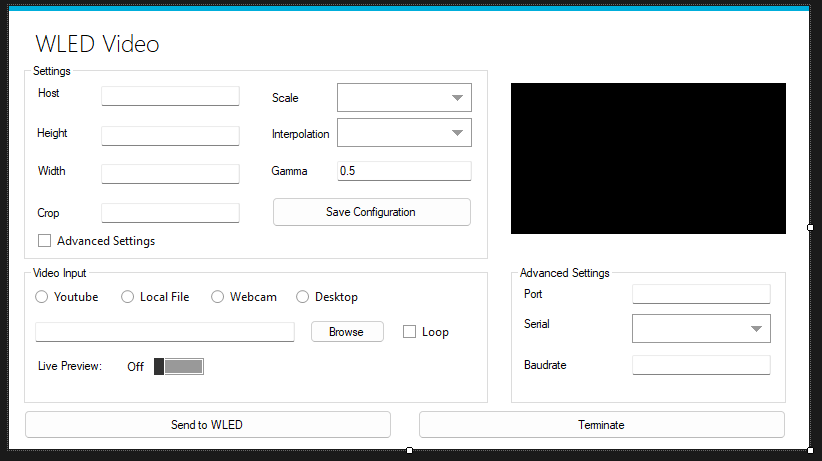

# WLED Video GUI

> **⚠️ DEPRECATION NOTICE**
> 
> This project is no longer actively maintained. For the latest version with enhanced features and improvements, please check out our new project:
> 
> [WLED Studio](https://github.com/BradyMeighan/WLED-Studio)
> 
> We encourage you to use the new project for the best experience and latest features.

WLED Video GUI is a C# application that provides a graphical interface for streaming video from your desktop to a WLED controller. This application integrates a Python script (`wledvideo.py`) to handle the video streaming. If you wanna check out the original CLI that this is based off of you can go here https://github.com/fieldOfView/WLED-video

## Features
- Stream video from YouTube, local files, webcam, or desktop to a WLED controller.
- Configure video settings such as resolution, crop, scale, and gamma.
- Advanced settings for serial communication with the WLED controller.
- Live preview of the video being streamed.

## Screenshot


## Requirements
- .NET Framework 4.7.2 or higher
- LibVLCSharp
- Python 3.x
- WLED controller

## Installation
1. Clone the repository:
    ```sh
    git clone https://github.com/yourusername/WLED-Video-GUI.git
    cd WLED-Video-GUI
    ```
2. Open the project in Visual Studio and restore the NuGet packages.
3. Install Python dependencies:
    ```sh
    pip install -r requirements.txt
    ```
4. Navigate to \WLED-video-gui\WLED-Video-GUI\bin\Debug and run WLED-Video-GUI.exe

## Configuration
1. Edit the `config.json` file to set your WLED controller's host, video resolution, and other settings.
2. Or use the GUI to adjust settings and save configurations.

## Usage
1. Run the application from Visual Studio or the compiled executable.
2. Configure your video settings in the GUI.
3. Select your video source and click "Send to WLED".
4. Optionally, enable live preview to see the video being streamed.

## Development
### Code Structure
- `Form1.cs`: Main form and application logic.
- `Program.cs`: Entry point of the application.
- `wledvideo.py`: Python script for handling video streaming.

### Adding New Features
1. Fork the repository.
2. Create a new branch:
    ```sh
    git checkout -b feature-name
    ```
3. Make your changes.
4. Commit your changes:
    ```sh
    git commit -m "Description of feature"
    ```
5. Push to the branch:
    ```sh
    git push origin feature-name
    ```
6. Create a pull request.

## Disclaimer
It's been a while since I've worked with C# and Windows Forms Apps, so this project may have some bugs. Everything has worked during my testing, but I welcome any contributions to improve and clean up the code. Your help is much appreciated!

## Contributing
Contributions are welcome! Please open an issue or submit a pull request.

## License
This project is licensed under the MIT License. See the [LICENSE](LICENSE) file for details.
